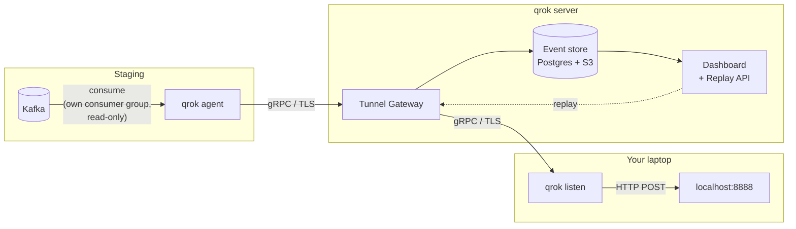

# qrok

**ngrok for Kafka.** Tunnel events from a staging broker straight to your laptop — capture everything, replay anything.

Debugging an event consumer usually means: deploy to staging, produce a test message, dig through logs, repeat. qrok removes the loop. A read-only agent sits next to your staging Kafka and streams every event to your local HTTP handler in real time. Each event is captured in the cloud, so you can replay it with one click — no re-producing, no "burning" messages in the broker.

- **Live tunnel** — staging events hit `localhost` seconds after they are produced.
- **Read-only by design** — the agent consumes with its *own* consumer group. It never commits other groups' offsets and never writes to your topics. Production consumers don't notice it exists.
- **Capture & replay** — every event is stored (Postgres + S3). Replay it from the dashboard or CLI without touching the broker.

Kafka is supported today; RabbitMQ is next.

## Install

**macOS (Homebrew):**

```bash
brew install Backend-dev1l/tap/qrok
```

**Linux / Windows / macOS binaries** — download from [GitHub Releases](https://github.com/Backend-dev1l/qrok/releases) (amd64 and arm64 for all three platforms):

```bash
curl -sL https://github.com/Backend-dev1l/qrok/releases/latest/download/qrok_$(uname -s)_$(uname -m).tar.gz | tar xz qrok
```

**From source** (Go 1.26+):

```bash
git clone git@github.com:Backend-dev1l/qrok.git && cd qrok && make build   # → ./bin/qrok
```

## Use

**On staging** — point the agent at your broker (read-only, safe to run next to production consumers):

```yaml
# qrok-agent.yaml
agent:
  token: "qrok_agt_..."     # issued by the control plane
  tunnel_id: my-tunnel
  gateway: qrok.example.com:9090
  source_type: kafka
  topics: [orders, payments]
kafka:
  brokers: [broker-1:9092]
```

```bash
qrok agent start --config qrok-agent.yaml
```

**On your laptop** — log in once, then listen:

```bash
qrok login --api https://qrok.example.com     # OAuth device flow, token saved locally
qrok listen --config qrok-listen.yaml         # events → POST http://127.0.0.1:8888/
```

```yaml
# qrok-listen.yaml
listen:
  gateway: qrok.example.com:9090
  tunnel_id: my-tunnel
  topics: []                      # empty = all tunnel topics
  forward: http://127.0.0.1:8888/
```

Every event arrives as an HTTP POST with the original payload as the body plus metadata headers:

```text
POST / HTTP/1.1
Content-Type: application/json
X-Qrok-Event-Id: 01JD3V7Q9K...
X-Qrok-Topic: orders
X-Qrok-Key: order-42
X-Qrok-Offset: 1337
X-Qrok-Replay: false

{"order_id": 42, "status": "created"}
```

**Replay** a captured event — from the dashboard (`/dashboard/`) or the CLI:

```bash
qrok replay 01JD3V7Q9K... --api https://qrok.example.com
```

## How it works



1. The **agent** joins the broker with a dedicated consumer group (`qrok-agent-<tunnel_id>`), so it shares nothing with production consumers. It only reads: the single write it performs is committing offsets of its *own* group.
2. Events are streamed over a mutually authenticated gRPC tunnel (agent tokens on staging, dev tokens issued via OAuth device flow on laptops). TLS protects everything in transit; end-to-end payload encryption (sealed on the agent, opened only by `qrok listen`) is on the roadmap.
3. The **gateway** persists each event (payloads above a size threshold go to S3) and fans it out to connected `qrok listen` clients.
4. **Replay** re-delivers a stored event through the same tunnel — the broker is never touched again.

## Try it in one minute

A self-contained demo — test Kafka, a toy producer, and a local receiver — lives in [`examples/kafka-quickstart`](examples/kafka-quickstart/):

```bash
docker compose -f examples/kafka-quickstart/docker-compose.yml up -d --wait
```

Full walkthrough in [examples/kafka-quickstart/README.md](examples/kafka-quickstart/README.md).

## Docs

- [`examples/`](examples/) — runnable demos
- [`docs/DEVELOPMENT.md`](docs/DEVELOPMENT.md) — building, testing, project layout, contributor guide
